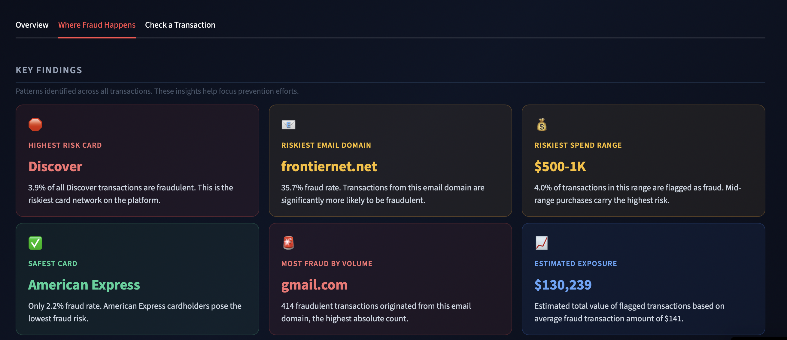
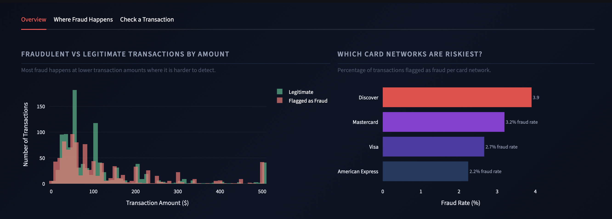
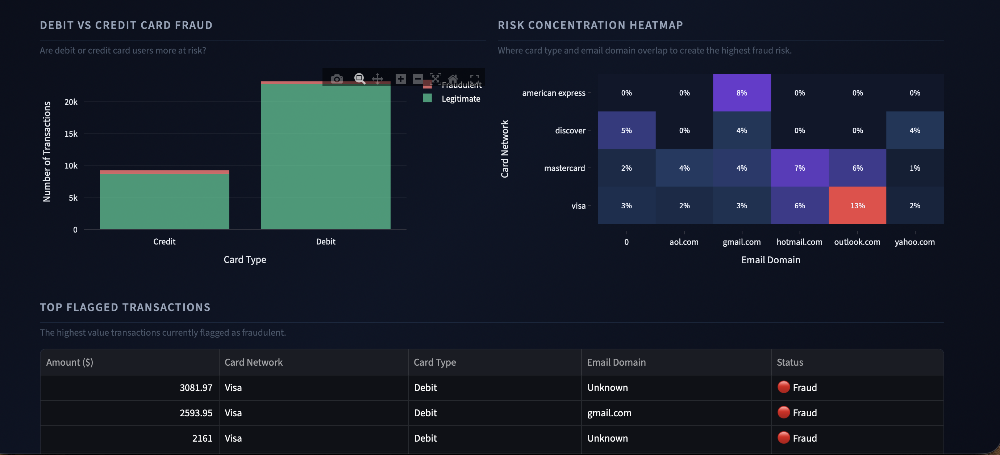
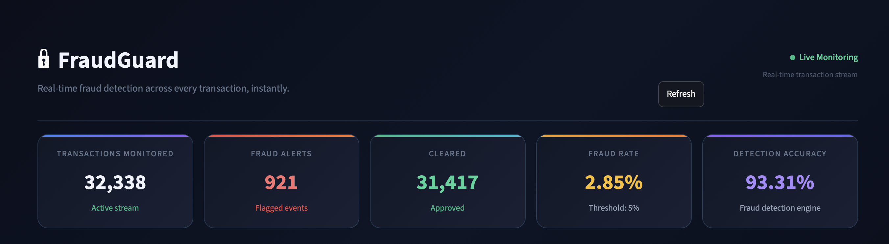
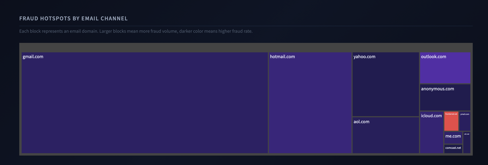
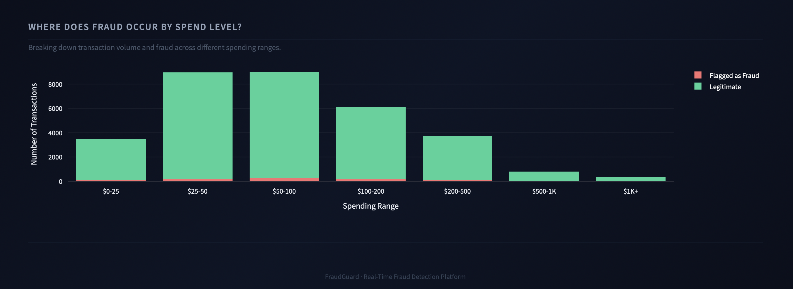
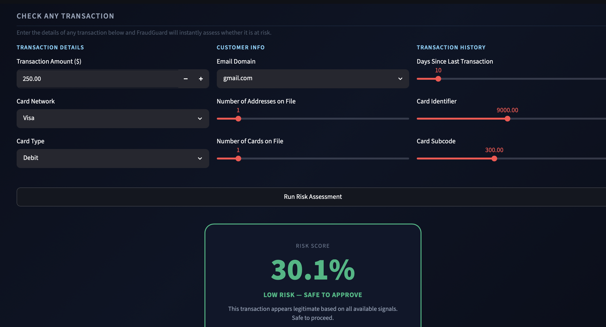

# 🔒 FraudGuard: Real-Time Fraud Detection Platform

*Streaming Pipeline for Instant Transaction Risk Intelligence*

    

---

## 📑 Table of Contents

- [Overview](#-overview)
- [Dashboard](#-dashboard)
- [Architecture](#-architecture)
- [Tech Stack](#-tech-stack)
- [Dataset](#-dataset)
- [Pipeline Details](#-pipeline-details)
- [Model Performance](#-model-performance)
- [Dashboard Features](#-dashboard-features)
- [Key Results](#-key-results)
- [Project Structure](#-project-structure)
- [Deployment Note](#-deployment-note)

---

## 📘 Overview

**FraudGuard** is an end-to-end real-time streaming pipeline that ingests financial transactions through Apache Kafka, processes them through a **Bronze-Silver-Gold medallion architecture** using Spark Structured Streaming and Apache Iceberg, scores them for fraud risk, and surfaces actionable intelligence through a live boardroom-grade monitoring dashboard.

**Key Highlights:**

- 🔄 Real-time event streaming with Apache Kafka (3 partitions, KRaft mode)
- 🏗️ Full Bronze-Silver-Gold medallion architecture on Apache Iceberg
- 🤖 Multi-model comparison with automatic best model selection (AUC: 0.9331)
- 📊 Executive-grade Streamlit dashboard backed by DuckDB
- ⚡ Sub-second event processing latency
- 🎯 82% recall on fraudulent transactions

---

## 📸 Dashboard

### Live Metrics


### Analytics Overview


### Spend Level Breakdown


### Key Findings


### Fraud Hotspots by Email Channel


### Risk Heatmap and Flagged Transactions


### Real-Time Transaction Scoring


---

## 🏗️ Architecture

```
Transaction Events
       │
       ▼
 Kafka (3 partitions, KRaft)
       │
       ▼
Spark Structured Streaming
       │
       ▼
Apache Iceberg Bronze Layer  ──►  Raw events, Parquet on disk
       │
       ▼
Apache Iceberg Silver Layer  ──►  Deduplicated, cleaned, MD5 hashed
       │
       ▼
Apache Iceberg Gold Layer    ──►  Pre-aggregated business intelligence
       │
       ▼
XGBoost Fraud Scorer         ──►  AUC: 0.9331, Recall: 82%
       │
       ▼
Streamlit Dashboard (DuckDB) ──►  Live monitoring and risk scoring
```

---

## 🛠️ Tech Stack

| Layer | Technology |
|---|---|
| Event Streaming | Apache Kafka 3.7 (KRaft, Docker) |
| Stream Processing | PySpark 3.5.3 Structured Streaming |
| Storage Format | Apache Iceberg 1.8.1 + Parquet |
| Query Layer | DuckDB |
| Fraud Scoring | XGBoost, Random Forest, Logistic Regression |
| Dashboard | Streamlit + Plotly |
| Containerization | Docker Desktop |

---

## 📦 Dataset

- **Source:** [IEEE-CIS Fraud Detection](https://www.kaggle.com/competitions/ieee-fraud-detection/data) — Kaggle Competition Dataset
- **Size:** 590,540 transactions across 394 features
- **Fraud Rate:** 3.5% (highly imbalanced class distribution)
- **Key Features:** Transaction amount, card network, email domain, billing address, device info, and 339 anonymized V-features
- **Split:** 80% training (472,432 rows) / 20% testing (118,108 rows)

> The dataset is not included in this repository due to size. Download it from Kaggle and place it under `data/ieee-fraud-detection/`.

---

## ⚙️ Pipeline Details

### Bronze Layer
- Kafka consumer reads transaction events in micro-batches via Spark Structured Streaming
- Writes raw events to Iceberg table with Kafka timestamp preserved
- 3 Parquet files written, one per Kafka partition
- 42,338 raw events captured

### Silver Layer
- Deduplicates on TransactionID, reducing 42,338 rows to 32,338 unique records
- Fills nulls with sensible defaults (email domain, card type)
- Adds `risk_label` column (FRAUD / LEGIT)
- Adds MD5 `row_hash` for data lineage tracking

### Gold Layer
- Fraud rate by card network
- Fraud rate by email domain
- Fraud rate by transaction amount tier
- Overall pipeline summary metrics

---

## 🤖 Model Performance

Three models were trained on 590K transactions and compared. The best performing model was automatically selected and deployed to the dashboard.

| Model | AUC Score |
|---|---|
| **XGBoost** | **0.9331** ✅ Selected |
| Random Forest | 0.9232 |
| Logistic Regression | 0.7540 |

- **Training set:** 472,432 transactions
- **Test set:** 118,108 transactions
- **Fraud recall:** 82% (catches 4 out of 5 fraudulent transactions)
- **Class imbalance handling:** `scale_pos_weight` applied (fraud rate: 3.5%)

---

## 📊 Dashboard Features

**Overview Tab**
- Five live metric cards: transactions monitored, fraud alerts, cleared, fraud rate, detection accuracy
- Transaction amount distribution: fraud vs legitimate overlay histogram
- Fraud rate by card network: gradient bar chart
- Transaction volume by spend tier: stacked bar breakdown

**Where Fraud Happens Tab**
- Six key finding cards: highest risk card, safest card, riskiest email domain, most fraud by volume, riskiest spend range, estimated financial exposure
- Fraud hotspot treemap by email channel
- Debit vs credit card fraud exposure
- Risk concentration heatmap: card network vs email domain
- Top 10 highest value flagged transactions

**Check a Transaction Tab**
- Enter any transaction details and receive an instant fraud probability score
- Plain English verdict: approve or block recommendation
- Visual risk score bar with percentage

---

## 📈 Key Results

| Metric | Value |
|---|---|
| Total Transactions Processed | 32,338 |
| Fraud Alerts Generated | 921 |
| Overall Fraud Rate | 2.85% |
| Detection Accuracy | 93.31% |
| Estimated Fraud Exposure | $130,239 |
| Highest Risk Card Network | Discover (3.9% fraud rate) |
| Highest Risk Email Domain | frontiernet.net (35.7% fraud rate) |
| Highest Risk Spend Range | $500-1K (4.03% fraud rate) |

---

## 📂 Project Structure

```
fraudguard/
├── docker-compose.yml
├── producer/
│   └── producer.py
├── spark_jobs/
│   ├── bronze_consumer.py
│   ├── silver_transformer.py
│   └── gold_aggregator.py
├── notebooks/
│   ├── train_models.py
│   ├── model_xgboost.json
│   ├── model_results.json
│   └── dashboard.py
└── .gitignore
```

---

## 📌 Deployment Note

FraudGuard is designed as a fully self contained, locally hosted pipeline. All components, including Kafka, Spark Structured Streaming, the Iceberg storage layers, and the Streamlit dashboard, run within Docker on the local machine. 

To run the project, clone the repository and start the full stack with `docker-compose up`. Once the containers are running, the dashboard is accessible at `localhost` on the configured port.

---

*Built with Kafka · Spark Structured Streaming · Apache Iceberg · XGBoost · DuckDB · Streamlit*
